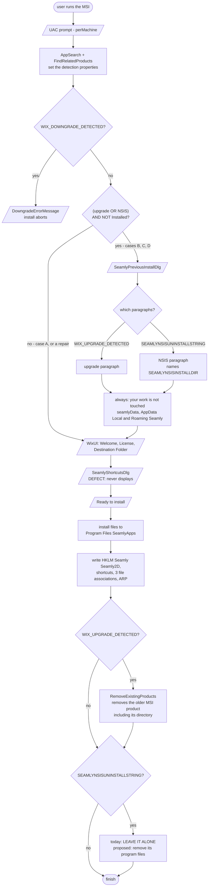
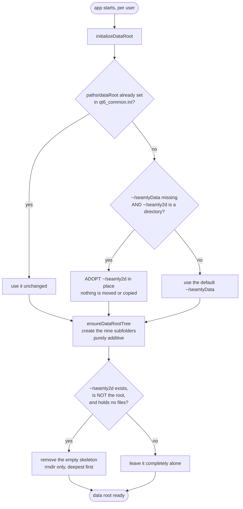

# Windows install — decision and data flow

What the installer decides, what the *application* decides, and what happens in
every combination of pre-existing installation. Written for Task 51 step 2, so
that the "uninstall the previous installation" behaviour is specified before it
is built.

Status marks used throughout: **[today]** is current, verified behaviour;
**[proposed]** is step 2, not yet implemented; **[undecided]** needs an answer
before it can be built.

## The one thing to understand first: there are two actors, not one

Program files and user data are handled by different actors, at different
times, with different privileges. Conflating them is what makes this confusing.

| | Installer (`Seamly2D-x64.msi`) | Application (`seamly2d.exe` / `seamlyme.exe`) |
|---|---|---|
| Runs | once, at install time | every launch, per user |
| As | **LocalSystem** (per-machine install) | the logged-in user |
| Owns | `C:\Program Files\SeamlyApps\`, HKLM rows, shortcuts, associations, ARP | the user-data root and its nine subfolders, settings under `AppData` |
| Knows | machine-wide registry, the previous install | that user's home directory and settings |

**A per-machine MSI cannot create per-user data.** Its server side runs as
LocalSystem, so `C:\Users\<name>\...` resolves to the SYSTEM profile, and it
could only ever cover the one user who ran setup — not everyone on the machine.
That is why the data root is settled by the app on first launch, on all three
platforms, and why the installer only *tells* the user where data lives.

## Detection inputs

Everything the installer branches on, and where it comes from.

| Property | Source | Meaning |
|---|---|---|
| `WIX_UPGRADE_DETECTED` | `FindRelatedProducts`, via the family `UpgradeCode` | an **older MSI** of this family is installed |
| `WIX_DOWNGRADE_DETECTED` | same | a **newer MSI** is installed |
| `SEAMLYNSISUNINSTALLSTRING` | `RegistrySearch`, `HKLM\...\Uninstall\Seamly2D\UninstallString`, `Bitness="always32"` | the **old NSIS** product is installed |
| `SEAMLYNSISINSTALLDIR` | `RegistrySearch`, `HKLM\SOFTWARE\NSIS_Seamly2D\Install_Dir`, `Bitness="always32"` | where it is, normally `C:\Program Files (x86)\Seamly2D` |
| `Installed` | Windows Installer | **this** product is already installed — i.e. repair / modify / uninstall, not a first install |

`Bitness="always32"` is required: the NSIS installer is 32-bit and never
switches registry view, so both of its keys live under `WOW6432Node` and a
default-view search from an x64 package finds nothing.

## The four cases, not three

The two detections are **independent**, so there are four states, and the
fourth is not hypothetical — it is exactly what the test laptop was in.

| # | Old NSIS present | New MSI present | Name |
|---|---|---|---|
| **A** | no | no | clean machine |
| **B** | **yes** | no | upgrade from the old standalone product |
| **C** | no | **yes** | upgrade from a previous MSI |
| **D** | **yes** | **yes** | both — a machine that got the MSI without removing NSIS |

Case D matters because the two products install to different directories, keep
separate ARP entries, and are removed by different mechanisms. Any step-2 rule
about "the previous installation" has to say which one it means.

## Installer flow

Two notes on that diagram:

- **`SeamlyShortcutsDlg` never displays.** The `ControlEvent` row is present and
  correct, but WiX 6.0.2's `InstallDirDlg` publishes `CheckTargetPath` rather
  than the v3/v4 `DoAction WixUIValidatePath`, and the `SpawnDialog` is skipped
  in that chain. `SEAMLYDESKTOPSHORTCUTS` defaults to 1, so the shortcuts are
  created and every automated check passes — the default works, the *choice* is
  never offered. Tracked as an open subtask in `TODO_MIGRATE.md`.
- **The page does not appear on repair or uninstall**, because of `AND NOT
  Installed`. That is deliberate.

## Application flow — the user-data root, at first launch

Runs in `Application2D::openSettings()` and `ApplicationME::openSettings()`,
independently of how the program files got there.

Three rules embedded there that must not be reversed casually:

- **Adoption, not migration.** An upgrading user's patterns can be many
  gigabytes and may sit on a cloud-synced drive, so the legacy tree becomes the
  root where it stands. Nothing is moved, copied or deleted.
- **Seeding happens in the applications, never inside `initializeDataRoot()`.**
  That is the only place the real home directory reaches it, and the unit tests
  call `initializeDataRoot()` — seeding from there would create folders in the
  developer's home on every test run.
- **Pruning uses `rmdir` only, and only on a tree with no files at any depth.**
  It cannot delete a file and refuses a non-empty directory, so it cannot run
  away. `removeRecursively()` is never used, and it bypasses the Recycle Bin.

## What happens in each case

Program files, by case:

| | **A** clean | **B** NSIS only | **C** MSI only | **D** both |
|---|---|---|---|---|
| Warning page | not shown | shown, NSIS paragraph | shown, upgrade paragraph | shown, **both** paragraphs |
| New files land in | `Program Files\SeamlyApps` | same | same | same |
| Old MSI directory | — | — | removed by `RemoveExistingProducts` | removed |
| Old NSIS directory | — | **[today]** left in place | — | **[today]** left in place |
| ARP entries afterwards | 1 | **[today]** 2 (NSIS shows no version) | 1 | **[today]** 2 |
| Associations | claimed | re-claimed from NSIS | kept | re-claimed |

User data, by case — the installer changes **none** of this; the app does it on
first launch:

| Data state found | Resulting root | Folders created |
|---|---|---|
| `paths/dataRoot` already configured | that path, unchanged | the nine, if missing |
| `~/seamly2d` exists, `~/seamlyData` does not | `~/seamly2d` (adopted) | the nine, if missing |
| neither exists | `~/seamlyData` | all nine |
| both exist | `~/seamlyData` | the nine, if missing |

The second row is the normal outcome of case B, and was what the test laptop
did: the old NSIS product had left `C:\Users\susan\seamly2d`, so that became the
data root and `~/seamlyData` was correctly never created.

## Open decisions for step 2

1. **[undecided] Which "previous installation" does step 2 remove?** Case B and
   case D both have an NSIS install; case C and D both have an MSI one, which
   Windows Installer already removes correctly by itself. If the rule is only
   about the NSIS product, say so explicitly.
2. **[undecided] Removing the NSIS product reverses a recorded Task 51
   decision**, and the reasons behind it still hold: its uninstaller is an
   interactive EXE that cannot run unattended reliably; its uninstall section is
   `RMDir /r $INSTDIR`, so it deletes **anything** in that folder, including
   files a user put there; and Windows Installer cannot roll it back if the rest
   of the install then fails, leaving a machine with neither product. If it is
   to be removed anyway, the safer shape is to delete the known file set
   ourselves from a deferred custom action rather than invoking their
   uninstaller — which needs its own decision about the ARP entry it leaves.
3. **[undecided] What happens to the NSIS ARP entry** if its files are removed —
   an orphaned "Seamly2D" with no version and a broken uninstaller is worse than
   leaving both alone.
4. **[undecided] The data-folder migration** the user made the "leave data to
   the app" decision conditional on: legacy `~/seamly2d` → `~/SeamlyData`, or
   old subfolder names → the nine standard ones? This is **Task 14**, and it
   contradicts the adopt-in-place rule above, so it is a design decision rather
   than a code change.
5. **[known defect]** `SeamlyShortcutsDlg` never displays, and the
   `SeamlyPreviousInstallDlg` line controls are 3 px too wide (error 2826 ×2).
   Both tracked in `TODO_MIGRATE.md`.

## Where the behaviour is defined

| Concern | File |
|---|---|
| Detection, dialogs, directories, components | `scripts/packaging/windows/seamly-family.wxs` |
| Package build + validation | `scripts/packaging/windows/smsi.ps1` |
| Assertions about the built package | `scripts/packaging/windows/test_msi_authoring.ps1` |
| Assertions about a real install | `scripts/packaging/windows/test_msi_install.ps1` |
| Data root resolution, adoption, seeding, pruning | `src/libs/vmisc/vcommonsettings.cpp` |
| Where the apps call it | `src/app/seamly2d/core/application_2d.cpp`, `src/app/seamlyme/application_me.cpp` |
