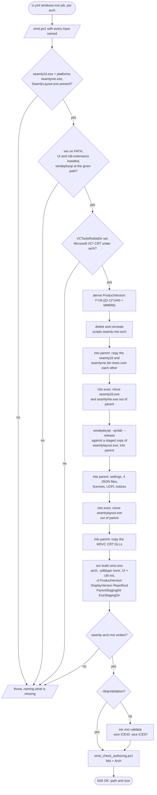
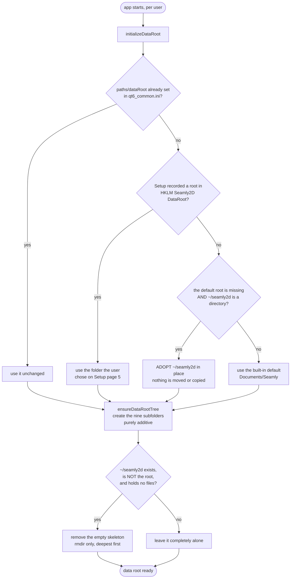

# Windows install — decision and data flow

What the installer decides, what the *application* decides, and what happens in
every combination of pre-existing installation.

Status marks used below: **[settled]** is decided and built; **[undecided]**
needs an answer before it can be built; **[known defect]** is a fault with an
open task.

## The one thing to understand first: there are two actors, not one

Program files and user data are handled by different actors, at different
times, with different privileges. Conflating them is what makes this confusing.

| | Installer (`seamly-x64.msi`) | Application (`seamly2d.exe` / `seamlyme.exe`) |
|---|---|---|
| Runs | once, at install time | every launch, per user |
| As | **LocalSystem** (per-machine install) | the logged-in user |
| Owns | program files, selected data root, update migration, HKLM rows, shortcuts, associations, ARP | standard data directories and runtime settings |
| Knows | machine-wide registry and the previous install | that user's current data root and settings |

**Fresh Setup creates the selected `SeamlyData` root.** The first app launch
creates the standard directories and writes their default paths. Uninstall
keeps the root and its contents.

**Update migration runs as the installing user.** The deferred custom action is
impersonated. It can read that user's settings, archives, and cloud folders.

## Detection inputs

Everything the installer branches on, and where it comes from.

| Property | Source | Meaning |
|---|---|---|
| `WIX_UPGRADE_DETECTED` | `FindRelatedProducts`, via the suite `UpgradeCode` | an **older MSI** of this suite is installed |
| `WIX_DOWNGRADE_DETECTED` | same | a **newer MSI** is installed |
| `SEAMLYLEGACYUNINSTALLSTRING` | `RegistrySearch`, `HKLM\...\Uninstall\Seamly2D\UninstallString`, `Bitness="always32"` | the **old NSIS** product is installed |
| `SEAMLYOLDS2DEXE` | `RegistrySearch` plus `FileSearch` under the legacy install directory | old `seamly2d.exe` exists |
| `SEAMLYOLDMEEXE` | `RegistrySearch` plus `FileSearch` under the legacy install directory | old `seamlyme.exe` exists |
| `SEAMLYOLDLAYOUTEXE` | `RegistrySearch` plus `FileSearch` under the legacy install directory | a legacy-directory `SeamlyLayout.exe` exists |
| `SEAMLYNEWLAYOUTEXE` | `RegistrySearch` plus `FileSearch` under the suite install directory | new Seamly with SeamlyLayout exists |
| `SEAMLYLEGACYINSTALLDIR` | `RegistrySearch`, `HKLM\SOFTWARE\NSIS_Seamly2D\Install_Dir`, `Bitness="always32"` | where it is, normally `C:\Program Files (x86)\Seamly2D` |
| `Installed` | Windows Installer | **this** product is already installed — i.e. repair / modify / uninstall, not a first install |

`Bitness="always32"` is required: the NSIS installer is 32-bit and never
switches registry view, so both of its keys live under `WOW6432Node` and a
default-view search from an x64 package finds nothing.

## The four cases, not three

The two detections are **independent**, so there are four states, and the
fourth is not hypothetical — it is exactly what the test laptop was in.

| # | Old NSIS present | New MSI present | Name |
|---|---|---|---|
| **A** | no | no | clean machine |
| **B** | **yes** | no | upgrade from the old standalone product |
| **C** | no | **yes** | upgrade from a previous MSI |
| **D** | **yes** | **yes** | both — a machine that got the MSI without removing NSIS |

Case D matters because the two products install to different directories, keep
separate ARP entries, and are removed by different mechanisms. Any step-2 rule
about "the previous installation" has to say which one it means.

## Package build flow

Before anything can be decided at install time, a package has to exist.
[`smsi.ps1`](smsi.ps1) is the only thing that builds one, and `ci.yml`'s
`windows-msi` job is the only thing that runs `smsi.ps1`.

**The script decides nothing about its inputs.** Every one is named on the
command line, so a package cannot inherit a Qt runtime, a CRT or a version from
whatever happens to be installed on the machine that built it.

| Input | What `ci.yml` passes | Required |
|---|---|---|
| `-Arch` | `matrix.arch` — `x64` or `arm64` | defaults to `x64` |
| `-Version` | `$env:VERSION_NUMBER`, the run's `YY.M.D.MMMM` | **yes** |
| `-Seamly2DBin` | `src\app\seamly2d\bin` | **yes** |
| `-SeamlyMeBin` | `src\app\seamlyme\bin` | **yes** |
| `-WinDeployQt` | `"$env:QT_ROOT_DIR\bin\windeployqt.exe"` | **yes** |
| `-SeamlyLayoutBuildDir` | nothing — the default is where the job's `cmake --build --preset release` writes it | no |
| `VCToolsRedistDir` | set by `ilammy/msvc-dev-cmd`, read from the environment | **yes** |

Four properties of that flow the installer flow below depends on:

- **The derived `ProductVersion` is what makes cases C and D work.** MSI ignores
  the 4th field for upgrade comparisons, so the 4-part `YY.M.D.MMMM` cannot be
  used directly. The mapping folds day and time into minutes-of-month, which
  increases strictly
  with every build, so `FindRelatedProducts` sees a newer package as newer and
  `WIX_UPGRADE_DETECTED` fires. Two packages built in the same minute are the
  same `ProductVersion`; that is why an upgrade test needs two runs.
- **One staging tree becomes one flat install directory.** `parent\` holds the
  single Qt runtime all three apps share, `exes\` holds only the three
  executables — kept out of the wildcard-harvested tree because the `.wxs`
  authors them explicitly so shortcuts and associations can reference them.
- **Every package carries all three apps.** There is no switch to leave
  SeamlyLayout out, so the SeamlyLayout Start Menu shortcut and icon are in
  every package on both architectures, and `smsi_check_authoring.ps1` asserts them
  unconditionally.
- **Two checks run on every build and both fail it.** `wix msi validate` says
  the package is well formed (ICE43 and ICE57 suppressed as false positives for
  a `perMachine` package; ICE61 stays visible and is expected).
  `smsi_check_authoring.ps1` says it still contains the decisions this document
  describes — the detection properties, the dialog chain, the removal
  components, the shortcuts and the registry rows. `-SkipValidation` skips the
  first; nothing skips the second.

## Installer flow

```mermaid
flowchart TD
    start([user runs the MSI]) --> uac[/UAC prompt - perMachine/]
    uac --> search[AppSearch + FindRelatedProducts<br/>set the detection properties]
    search --> down{WIX_DOWNGRADE_DETECTED?}
    down -->|yes| abort[/DowngradeErrorMessage<br/>install aborts/]
    down -->|no| wizard[/WelcomeDlg<br/>LicenseAgreementDlg/]

    wizard --> warn{"old parent apps without Layout<br/>OR new Layout exists?"}

    warn -->|no - case A, or a repair| dir
    warn -->|yes - cases B, C, D| dlg[/SeamlyPreviousInstallDlg/]

    dlg --> para{which paragraphs?}
    para -->|WIX_UPGRADE_DETECTED| pu[upgrade paragraph]
    para -->|SEAMLYLEGACYUNINSTALLSTRING| pn[NSIS paragraph<br/>names SEAMLYLEGACYINSTALLDIR]
    pu --> always
    pn --> always
    always[always: your work is not touched<br/>SeamlyData, AppData Local and Roaming Seamly] --> dir

    dir[/InstallDirDlg<br/>program directory/] --> dataroot[/SeamlyDataDirDlg<br/>user-data root/]
    dataroot --> update{previous install?}
    update -->|yes| migrate[/SeamlyDataMigrateDlg<br/>archive and migrate work?/]
    update -->|no| shortcuts
    migrate --> shortcuts[/SeamlyShortcutsDlg<br/>desktop shortcuts/]
    shortcuts --> ready[/VerifyReadyDlg/]
    ready --> install[install files to<br/>Program Files SeamlyApps]

    install --> reg[write HKLM Seamly Seamly2D,<br/>shortcuts, 3 file associations, ARP]
    reg --> rep{WIX_UPGRADE_DETECTED?}
    rep -->|yes| rem[RemoveExistingProducts<br/>removes the older MSI product<br/>including its directory]
    rep -->|no| legacy
    rem --> legacy

    legacy{SEAMLYLEGACYINSTALLDIR?}
    legacy -->|no| migrateData
    legacy -->|yes| kill["remove the NSIS product:<br/>its directory tree, its Start Menu folder,<br/>and both of its registry keys.<br/>Its uninstall.exe is never run"]
    kill --> migrateData

    migrateData{migration selected?}
    migrateData -->|no| done([finish])
    migrateData -->|old Seamly| oldzip[read seamly2d root from settings<br/>archive and extract<br/>rename to SeamlyData]
    migrateData -->|new Seamly| newzip[archive SeamlyData<br/>keep SeamlyData as top level<br/>skip when location is unchanged]
    oldzip --> settings[add missing directories<br/>retain non-path settings<br/>replace path settings]
    newzip --> settings
    settings --> done
```

Three notes on that diagram:

- **The package defines its own dialog set** (Task InstWinX64.1), so every arrow
  between pages is a `NewDialog` row it authors itself, and `Back` reverses each
  one. A stock set cannot be extended this way: `WixUI_InstallDir`'s `NewDialog
  VerifyReadyDlg` row sits at `Ordering` 4 with the condition `1`, so no page can
  precede it and no condition can exclude it.
- **The previous-install page does not appear on repair or uninstall**, because
  of `AND NOT Installed`. That is deliberate.
- **Silent installs show no page at all.** `/qn` runs no UI sequence, so pass
  `SEAMLYDATAPARENT` (or `SEAMLYDATAROOT`), `SEAMLYCOPYUSERDATA` and
  `SEAMLYDESKTOPSHORTCUTS` on the command line to override the defaults.

## Application flow — the user-data root, at first launch

Runs in `Application2D::openSettings()` and `ApplicationME::openSettings()`,
independently of how the program files got there.

Four rules embedded there that must not be reversed casually:

- **What Setup promised outranks every built-in default.** Page 5 shows the
  user a folder and tells them the apps will use it. `installerDataRoot()` is
  what makes that true. It sits below `paths/dataRoot`, so a user who moves the
  root in Preferences keeps their choice (Task InstWinX64.00).

- **The MSI handles interactive Windows updates.** The in-app legacy flow stays
  as a fallback for silent installs and non-Windows packages.
- **Seeding happens in the applications, never inside `initializeDataRoot()`.**
  That is the only place the real home directory reaches it, and the unit tests
  call `initializeDataRoot()` — seeding from there would create folders in the
  developer's home on every test run.
- **Pruning uses `rmdir` only, and only on a tree with no files at any depth.**
  It cannot delete a file and refuses a non-empty directory, so it cannot run
  away. `removeRecursively()` is never used, and it bypasses the Recycle Bin.

## What happens in each case

Program files, by case:

| | **A** clean | **B** NSIS only | **C** MSI only | **D** both |
|---|---|---|---|---|
| Warning page | not shown | shown, NSIS paragraph | shown, upgrade paragraph | shown, **both** paragraphs |
| New files land in | `Program Files\SeamlyApps` | same | same | same |
| Old MSI directory | — | — | removed by `RemoveExistingProducts` | removed |
| Old NSIS directory | — | **removed** | — | **removed** |
| Old NSIS Start Menu folder | — | **removed** (installing user's) | — | **removed** (installing user's) |
| Old NSIS registry keys | — | **removed** (32-bit view) | — | **removed** |
| ARP entries afterwards | 1 | 1 | 1 | 1 |
| Associations | claimed | re-claimed from NSIS | kept | re-claimed |

User data, by case — the installer changes **none** of this; the app does it on
first launch:

| Data state found | Resulting root | Folders created |
|---|---|---|
| `paths/dataRoot` already configured | that path, unchanged | the nine, if missing |
| Setup recorded a root | that path | all nine |
| `~/seamly2d` exists, the default root does not | `~/seamly2d` (adopted) | the nine, if missing |
| neither exists | `<Documents>/Seamly` | all nine |
| both exist | `<Documents>/Seamly` | the nine, if missing |

The second row is the normal outcome of an MSI install: Setup writes the page-5
answer to `HKLM\SOFTWARE\Seamly\Seamly2D\DataRoot`, defaulting to
`C:\Users\<user>\Documents\SeamlyData`.

The third row is the normal outcome of case B on a machine with no recorded
root, and was what the test laptop did before Task InstWinX64.00: the old NSIS
product had left `C:\Users\susan\seamly2d`, so that became the data root.

## Decisions

1. **[settled] Which "previous installation" is removed.** Only the **NSIS**
   product needs its own code. A previous MSI is removed by
   `RemoveExistingProducts`, so cases C and D need nothing extra there.
2. **[settled] The NSIS product is removed, but its `uninstall.exe` is never
   run.** The MSI is a strict superset — it installs seamly2d and seamlyme too,
   so leaving the old product behind means two copies of each and Start Menu
   shortcuts that launch the old binaries. Invoking their uninstaller is the
   hazard: it is interactive, its `RMDir /r $INSTDIR` deletes anything else in
   the folder, and Windows Installer cannot roll it back if the install then
   fails. Deleting the four things it created has none of those properties, and
   `RemoveFiles` rolls it back. **The dialog warns the user to move their own
   files out of that folder first**, because the directory goes as a whole.
3. **[settled] The NSIS ARP entry goes with it** —
   `HKLM\...\Uninstall\Seamly2D` and `HKLM\SOFTWARE\NSIS_Seamly2D` are both
   removed, so there is no orphaned entry pointing at a deleted uninstaller.
4. **[undecided] The data-folder migration** the user made the "leave data to
   the app" decision conditional on: legacy `~/seamly2d` → `~/SeamlyData`, or
   old subfolder names → the nine standard ones? This is **Task 14**, and it
   contradicts the adopt-in-place rule above, so it is a design decision rather
   than a code change.
5. **[settled] `SeamlyShortcutsDlg` displays**, through the custom dialog set
   (Task InstWinX64.1). The authoring is verified; the pages themselves await
   the interactive run, InstWinX64.1.6.
6. **[known defect]** The `SeamlyPreviousInstallDlg` line controls are 3 px too
   wide (error 2826 ×2). Task InstWinX64.7.6.

## Where the behaviour is defined

| Concern | File |
|---|---|
| Detection, dialogs, directories, components | `scripts/packaging/windows/smsi.wxs` |
| Staging layout, version mapping, `wix build`, ICE suppressions | `scripts/packaging/windows/smsi.ps1` |
| The only invocation of that script | `.github/workflows/ci.yml`, job `windows-msi` |
| Assertions about the built package | `scripts/packaging/windows/smsi_check_authoring.ps1` |
| Assertions about a real install | `scripts/packaging/windows/test_msi_install.ps1` |
| Data root resolution, adoption, seeding, pruning | `src/libs/vmisc/vcommonsettings.cpp` |
| Where the apps call it | `src/app/seamly2d/core/application_2d.cpp`, `src/app/seamlyme/application_me.cpp` |
